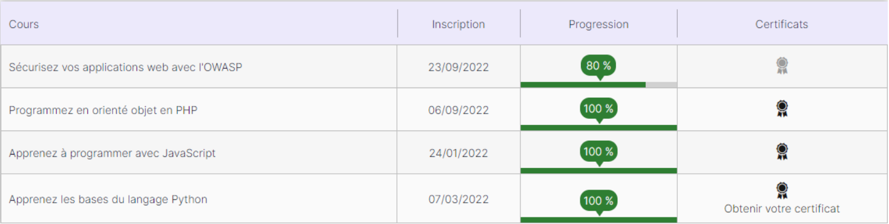
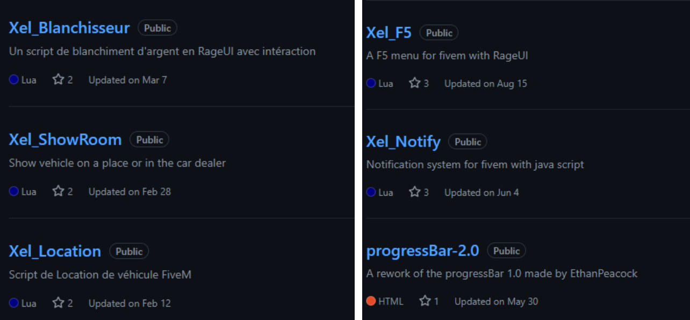
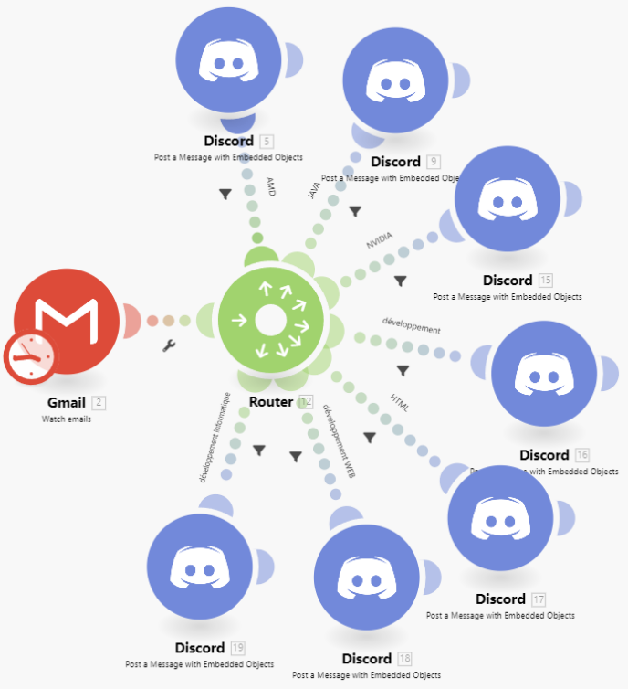
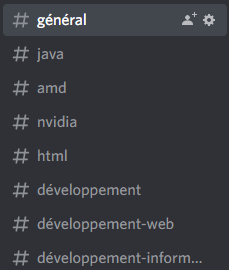
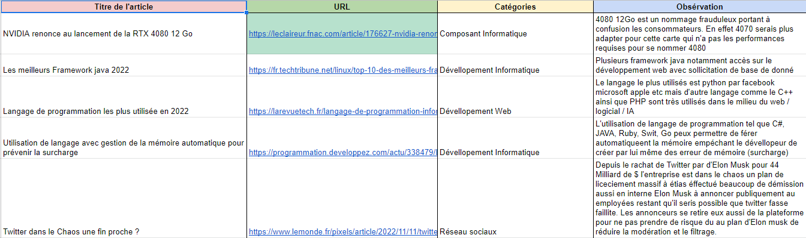
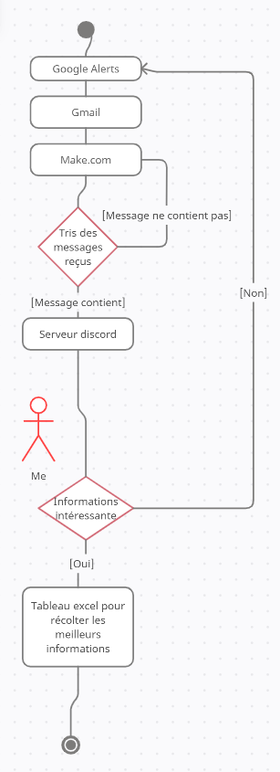

# Compétence SIO [A 1.6]

## Organisation de son développement professionnel

### Apprentissage personnel

**OpenClassroom :** Afin de développer mes connaissances personnelles, j’ai suivi plusieurs cours via le site OpenClassroom.
OpenClassroom propose des formations gratuites ou payantes sur divers sujets. J’ai personnellement suivi des formations gratuites sur le développement web.

Formations suivies sur OpenClassroom :

**Apprentissage Autonome :** Afin de pouvoir créer des serveurs de jeux FiveM, j’ai appris de manière autodidacte le langage LUA à partir de la documentation officielle ou de scripts proposés par des personnes sur GitHub. 
Pour aller plus loin et atteindre mon objectif, j’ai aussi pu me familiariser avec les natives proposées par FiveM ainsi que le framework ESX. Avec du temps et de la persévérance, j’ai appris à utiliser LUA convenablement et je suis aujourd’hui capable de réaliser toute sorte de scripts. Certains sont présents sur mon GitHub pour les autres utilisateurs de la communauté.

- [Source LUA](https://www.lua.org/pil/1.html)

- [Source FiveM Natives](https://docs.fivem.net/natives/)

- [Source ESX Docs](https://docs.esx-framework.org/legacy/installation/)

- [Mes créations](https://github.com/Xeltax?tab=repositories)

Voici un exemple des créations que je propose :

### Veille Informatique

Pour réaliser ma veille informatique, j’utilise plusieurs outils :
- Google Alerts sur les sujets liés au développement informatique 
  - HTML,
  - PHP,
  - C#,
  - Développement Web,
  - Développement Informatique,
  - JAVA,
  - SQL
  

- Le site [Make.com](https://www.make.com/en) qui me permet de faire un lien automatique entre mes mails de veille et un serveur discord. 

L'objectif de cette démarche est d'avoir tous les jours à 9 h, les informations de veille qui arrivent sur mon serveur discord pour une plus grande facilité de visibilité. 

Voici à quoi ressemble le scénario sur Make.com :

Les mails sont récupérés puis triés selon leur intitulé pour être ensuite redirigés vers le salon de mon serveur discord de manière automatisée et organisée.

Grâce à cela, je peux avoir un premier tri de mes articles de veille, ensuite je fais mon choix des articles les plus pertinents pour moi, puis je l’ai mis dans un tableau excel pour une organisation optimale.

Diagramme UML de la veille informatique

### Gestion de son identité professionnelle

**Mon identité anonyme :** En tant que créateur de contenu pour FiveM, comme dit précédemment j’utilise le pseudonyme Xeltax. Cela permet de rester anonyme auprès des utilisateurs. Pour développer mon identité professionnelle, j’utilise principalement mon github ainsi que mon [site Web](https://xeltax.github.io).

Cela permet aux gens de me connaître sans avoir connaissance de ma réelle identité.

**Ma réelle identité :** Afin de développer ma réelle identité professionnelle, j'utilise Linkedin.

Je suis actuellement en train de constituer mon réseau, avant de commencer à poster différents post pour l'agrandir encore plus et potentiellement me faire repérer par des entreprises interessées par mon profil.

[Mon profil LinkedIn](https://www.linkedin.com/in/cl%C3%A9ment-honor%C3%A9-7166aa238/)

### Développement de son projet professionnel

Pour développer mon projet professionnel, je compte m’inscrire sur la plateforme Fiverr qui met en relation utilisateurs et créateurs dans différents domaines (Musique, Dessin, Animation, Développement …). Cette plateforme pourra me permettre d’avoir des contrats avec des particuliers. Cela me permettra de développer des sites Web / Applications contre une rémunération. Ce qui au fur et à mesure pourra m’améliorer dans ma manière de coder, l’approche des projets ainsi que la gestion d’une relation clients et de support.

