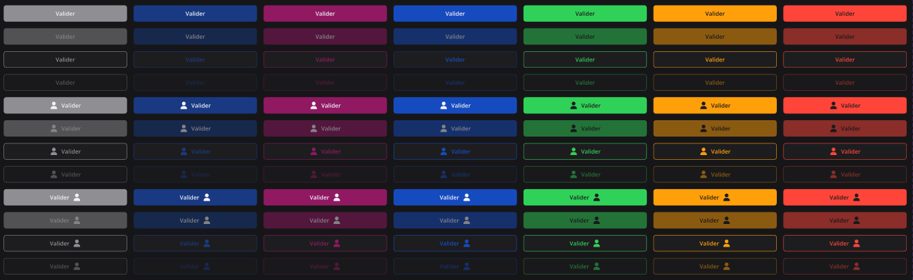
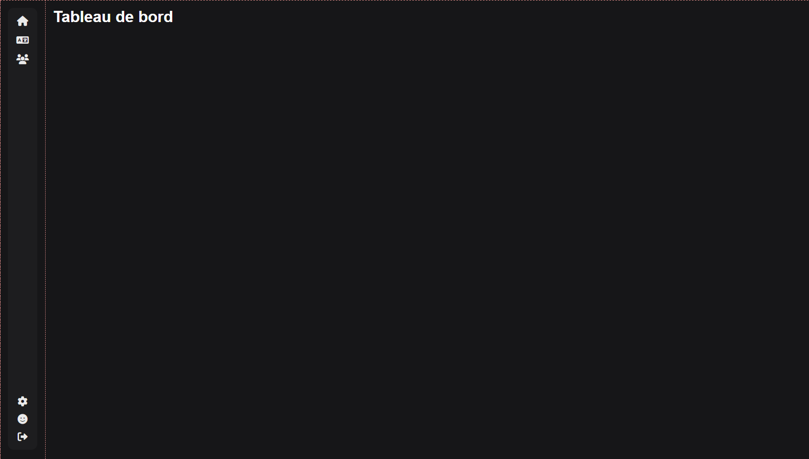
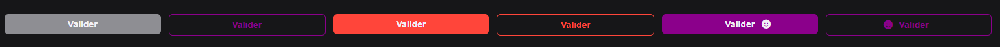
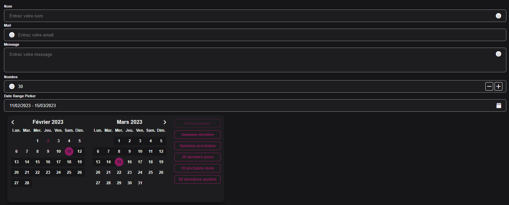
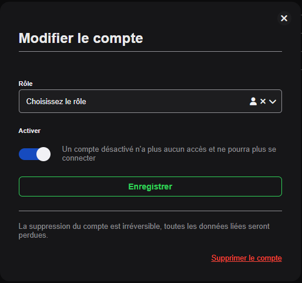

# Compétence SIO [A 2.1]

## Conception et développement d’applications

### Création de composants web

**Activités** : Afin de réaliser des composants web, j'ai utilisé le framework NextJS ainsi que le langage TypeScript.
L'utilisation de ses deux technologies m'a permis de créer de multiples composants modulable et réutilisable.

**Fil directeur** : Pour le design des composants, nous avons utilisé Figma un outil de design graphique en ligne.
Cela permet de gagner du temps et de la précision dans la création des composants.

**Composants réalisés :**

- **Le layout** base de toutes les pages, il permet de créer le menu latéral afin de ne pas répéter du code.

 

- **Les boutons** sont les composants qui possèdent le plus de variations css afin de pouvoir être utilisé dans de multiples contextes.

 

- **Les inputs** sont les composants qui ont pris le plus de temps à réaliser, notamment avec les validations des champs et l'input calendrier qui est un composant custom.

 
 
- **Les Popups** sont des composants qui permettent d'afficher des informations supplémentaires à l'utilisateur. Ici, nous l'utilisons principalement pour des interactions.

 
 
**L'avantage des composants :**

Les composants permettent désormais de créer des pages web rapidement et de manière modulaire. En effet, chaque composant possède des variants ce qui permet une grande flexibilité.